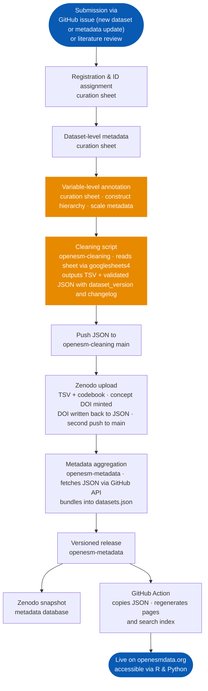

Every dataset in openESM passes through a structured curation pipeline before it becomes available. This page explains each stage (what happens, where it happens, and what it produces).

    On this page
    <a class="docs-topic-chip" href="#stage-1-submission">Submission</a>
    <a class="docs-topic-chip" href="#stage-3-data-cleaning--harmonization">Cleaning and harmonization</a>
    <a class="docs-topic-chip" href="#stage-8-release--automated-website-update">Release and automation</a>
    <a class="docs-topic-chip" href="#pipeline-overview">Pipeline overview</a>

---

## Stage 1: Submission

Datasets enter the pipeline in one of two ways: we identify them through literature review, or researchers submit them by opening an issue at [openesm-project/openesm-metadata](https://github.com/openesm-project/openesm-metadata/issues) using one of the provided issue templates (new dataset submission or metadata update). At this point, the dataset is registered in our curation tracking sheet with basic provenance information and assigned a unique four-digit ID (e.g. `0042`). Currently, this action is performed by an internal team member, but we plan to automate it in the future. 

---

## Stage 2: Metadata collection

We populate dataset-level metadata in our curation sheet: citation, sample size, country, study design, assessment frequency, assessment duration, number of items, language, and license. We also locate the codebook and any cleaning or scoring code associated with the original study. Each dataset gets its own tab in the curation sheet where variable-level metadata will be annotated in the next stage.

---

## Stage 3: Data cleaning & harmonization

This is the core harmonization step. A dedicated R cleaning script is written for each dataset and stored in [openesm-cleaning](https://github.com/openesm-project/openesm-cleaning). The script reads variable-level metadata directly from the curation sheet at runtime via `googlesheets4`, applies all harmonization steps, and produces two outputs: a cleaned data file in TSV format, and a structured metadata file in JSON format stored in `data/metadata/`.

Harmonization includes:

- **Variable naming**: variables are standardized to a consistent lowercase, snake_case convention
- **Missing values**: study-specific missing value codes are recoded to `NA`
- **Date and time**: timestamps are standardized to ISO 8601
- **Range validation**: observed values are checked against expected scale bounds
- **Person-level summaries**: observation counts per participant are computed and appended

The output JSON includes a `dataset_version` field and a `changelog` array recording all changes to the dataset. The cleaning script preserves any existing changelog entries on re-runs, so manually added entries are never overwritten.

The raw data are never modified. The cleaning script is the complete, reproducible record of every transformation applied.

After the script runs, the output JSON can be validated against the openESM metadata schema via `validate_metadata_json()`.

---

## Stage 4: Variable-level metadata annotation

For each variable, we annotate structured metadata in the curation sheet (see our [Data Documentation]() for more information). This annotation is read by the cleaning script at runtime and embedded in the output JSON, so the variable browser on each dataset page is generated entirely from the metadata file.

---

## Stage 5: Push to openesm-cleaning main

The finalized JSON in `data/metadata/` is committed and pushed to the `main` branch of `openesm-cleaning`. This is a required step: the next stage fetches metadata directly from this branch via the GitHub API, so local-only files are invisible to it.

At this point the Zenodo DOI is not yet known, so the JSON is pushed once before the Zenodo upload and again after (Stage 6) once the DOI has been obtained.

---

## Stage 6: Zenodo upload

The cleaned TSV and codebook are uploaded to the [openESM Zenodo collection](https://zenodo.org/communities/openesm), where they receive a permanent DOI. We store the overarching concept DOI in the JSON metadata, which always resolves to the most current version of the dataset when accessed by the R and Python packages. The DOI is added to the metadata JSON, which is regenerated and pushed to `openesm-cleaning` main.

When a new version of the dataset is released, the concept DOI always resolves to the latest version, so no updates to the JSON are needed. When updating on Zenodo, provide the existing DOI for smooth updates of the DOI.

---

## Stage 7: Metadata aggregation in openesm-metadata

With the JSON live on `openesm-cleaning` main, we run two scripts in [openesm-metadata](https://github.com/openesm-project/openesm-metadata). The first fetches all per-dataset JSON files from `openesm-cleaning` via the GitHub API and places them into versioned dataset folders. The second aggregates all individual JSONs into a single `datasets.json` file that the website consumes. Both steps are committed to `openesm-metadata`. This process is initiated by opening an issue in `openesm-metadata` using the provided templates, which include a maintainer checklist for each case.

Before creating a release, the following checklist must be completed in order:

- [ ] All affected dataset JSONs updated and pushed to `openesm-cleaning` main
- [ ] `copy_metadata.R` run and output committed
- [ ] `bundle_metadata.R` run and `datasets.json` committed and verified
- [ ] All changes pushed to `openesm-metadata` main
- [ ] Release notes drafted

---

## Stage 8: Release & automated website update

A new versioned release is created in `openesm-metadata` following semantic versioning (see [Data Documentation]() for versioning details). This release triggers two automated processes:

1. The `openesm-metadata` repository is synced to its linked Zenodo record, creating a citable, versioned snapshot of the full metadata database.
2. A GitHub Action copies the updated JSON files to the [openesm](https://github.com/openesm-project/openesm) website repository and runs three Node.js scripts that regenerate the dataset pages, the dataset table, and the search index. The result is committed and GitHub Pages deploys automatically.

The dataset is then live at `openesmdata.org` and accessible via the openESM R and Python packages.

---

## Pipeline overview

